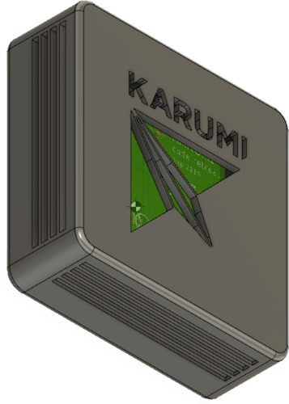

### Wifi led strip control and Infrared receiver bridge



This is the source code of the Karumi WIFI board internal workshop.

### Install Arduino and ESP8266 board

Download Arduino IDE, [link](https://www.arduino.cc/en/main/software)

You can follow this official page to install ESP8266 board into Arduino, [link](http://arduino.esp8266.com/Arduino/versions/2.0.0/doc/installing.html)


### PlatformIO

You can check the [getting started](https://platformio.org/get-started) page in the PlatformIO site to know how to set up the environment for your platform.

There are two different configurations, `irled` which is the firmware to turn on/off led strip and `test-irled` which is the firmware we use for hardware testing purposes.

Run normal firmware: 
```
pio run -t upload -e irled
```

Run test environment firmware: 
```
pio run -t upload -e test-irled
```

### Flash it with FT232RL FTDI

[FT232RL FTDI chip](https://www.ftdichip.com/Products/ICs/FT232R.htm) is a USB to serial UART interface with optional clock generator output. 

You need to install the following drivers to make it working on your computer, [download drivers](https://www.ftdichip.com/Drivers/D2XX.htm). Also, I'd recommend to watch this video tutorial [how to install this driver on MAC OS](https://www.youtube.com/watch?v=Ir2PVz1870E&feature=youtu.be). There are other videos to install in other systems on the original website.

### How to use it

You need to connect it to 12v 1A power supply, it creates an WIFI access point with an SSID KARUMI-XXX without password, after connect you need to connect to 192.168.4.1 IP.

