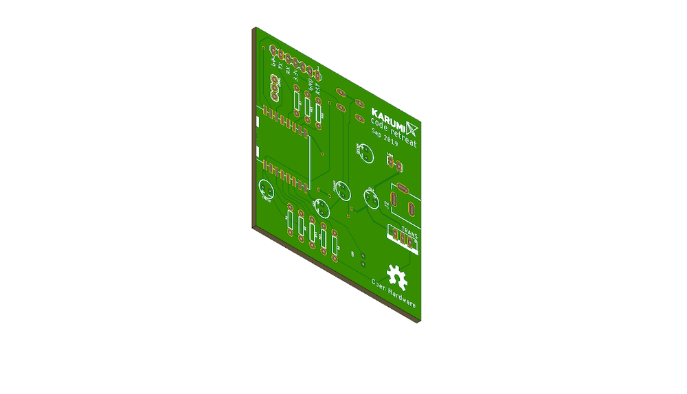

### Wifi led strip control and Infrared receiver bridge


*This is the source code of the Karumi WIFI board.* This board its used to turn on/off a led stripe with a remote control or a WIFi request, also, can be used to create a bridge between remote control commands to MQTT or HTTP requests, *this is not currently supported.*

### Install Arduino and ESP8266 board

Download Arduino IDE, [link](https://www.arduino.cc/en/main/software)

You can follow this official page to install ESP8266 board into Arduino, [link](http://arduino.esp8266.com/Arduino/versions/2.0.0/doc/installing.html)


### PlatformIO

You can check the [getting started](https://platformio.org/get-started) page in the PlatformIO site to know how to set up the environment for your platform.

There are two different configurations, `irled` which is the firmware to turn on/off led strip and `test-irled` which is the firmware we use for hardware testing purposes.

Run normal firmware: 
```
pio run -t upload -e irled
```

Run test environment firmware: 
```
pio run -t upload -e test-irled
```

### Build the website locally

You can run the ESP8266 website locally on your machine running:

```
yarn start
```

Start command will starts the website on `http://localhost:8080`.

Build the website into the ESP8266 code:

```
yarn build
```

The build process will be triggered before flash the program into the ESP8266 if some change was made on the `html` folder.

You can have a full web production experience locally if you run a web socket server locally before run `yarn build` with:

```
yarn http:server
```

This command will starts a local server with Web sockets and HTTP serving the `index.html` file from `build` folder.


### Flash it with FT232RL FTDI

[FT232RL FTDI chip](https://www.ftdichip.com/Products/ICs/FT232R.htm) is a USB to serial UART interface with optional clock generator output. 

You need to install the following drivers to make it working on your computer, [download drivers](https://www.ftdichip.com/Drivers/D2XX.htm). Also, I'd recommend to watch this video tutorial [how to install this driver on MAC OS](https://www.youtube.com/watch?v=Ir2PVz1870E&feature=youtu.be). There are other videos to install in other systems on the original website.



### Firmware configuration

Input and output configuration:

    - GPIO16: Board button when pressed input signal is HIGH.
    - GPIO14: Internal feedback led.
    - GPIO12: Turn on/off led stripe, HIGH to turn it on.
    - GPIO5: Infrared input to read signals using [IRremoteESP8266](https://github.com/crankyoldgit/IRremoteESP8266) library.

### How to use it

You need to connect it to 12v 1A power supply, it creates an WIFI access point with an SSID KARUMI-XXX without password, after connect you need to connect to 192.168.4.1 IP.

Open Hardware
--------------

Hardware designs files are licensed under the [Creative Commons Attribution-ShareAlike 3.0 Unported License](http://creativecommons.org/licenses/by-sa/3.0/) and follow the terms of the [OSHW (Open-source hardware) Statement of Principles 1.0.](http://freedomdefined.org/OSHW)

License
-------

    Copyright 2019 Karumi

    Licensed under the Apache License, Version 2.0 (the "License");
    you may not use this file except in compliance with the License.
    You may obtain a copy of the License at

       http://www.apache.org/licenses/LICENSE-2.0

    Unless required by applicable law or agreed to in writing, software
    distributed under the License is distributed on an "AS IS" BASIS,
    WITHOUT WARRANTIES OR CONDITIONS OF ANY KIND, either express or implied.
    See the License for the specific language governing permissions and
    limitations under the License.